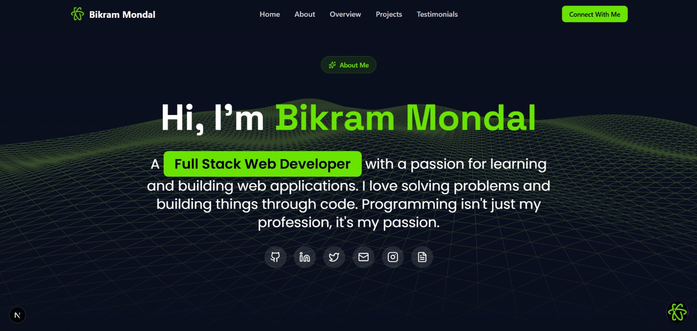

# 🚀✨ Bikram Mondal – Portfolio



A modern, interactive, and AI-powered portfolio website showcasing my journey as a Full-Stack Developer and AI/ML enthusiast. Built with cutting-edge technologies, featuring stunning 3D animations, an intelligent AI chatbot, and a seamless user experience across all devices.

Grab a coffee ☕, explore my work, and let's build something amazing together!

---

## 🌟 Features

- 🎨 **Stunning 3D Visuals** – Interactive Three.js wireframe landscapes and animated components
- 🤖 **AI-Powered Chat Assistant** – Reactz Agent with RAG (Retrieval-Augmented Generation) for intelligent conversations
- 📧 **Smart Email Integration** – AI-driven email composition and sending directly from the chat
- 🎭 **Dynamic Project Showcase** – Carousel-based project display with smooth animations
- 🏆 **Interactive Certificates Section** – Tabbed interface for skills, hackathons, and extracurricular achievements
- 💬 **Live Testimonials** – Real-time testimonial submission with MongoDB integration
- 🌐 **Fully Responsive Design** – Optimized for mobile, tablet, and desktop (320px to 4K)
- 🎯 **Smooth Animations** – Framer Motion powered transitions and micro-interactions
- 🌙 **Dark Theme UI** – Modern, eye-friendly dark interface with neon green accents
- 🔄 **Real-time Updates** – Dynamic content loading and state management
- 🎪 **Bento Grid Layout** – Modern card-based design with orbiting tech stack visualization
- 📱 **Mobile-First Approach** – Hamburger menu, touch-friendly controls, and adaptive layouts

---

## 🛠️ Technologies Used

### Frontend
- **Next.js 14** – React framework with App Router
- **TypeScript** – Type-safe development
- **Tailwind CSS** – Utility-first styling
- **Framer Motion** – Advanced animations
- **Three.js / React Three Fiber** – 3D graphics and animations
- **Shadcn/ui** – Beautiful, accessible UI components

### Backend & AI
- **Python / Flask** – RAG pipeline backend
- **LangChain** – AI agent orchestration
- **Google Gemini API** – Large language model integration
- **ChromaDB** – Vector database for document retrieval
- **MongoDB** – Database for testimonials and user data

### Additional Tools
- **React Markdown** – Markdown rendering in chat
- **React Icons** – Comprehensive icon library
- **React Parallax Tilt** – 3D tilt effects
- **Lucide Icons** – Modern icon set
- **Nodemailer** – Email sending functionality

---

## ⚙️ Installation

### Prerequisites
- Node.js 18+ and npm/yarn
- Python 3.9+ (for RAG backend)
- MongoDB instance (local or cloud)
- Google Gemini API key

### 1. Clone the repository
```bash
git clone https://github.com/BikramMondal5/bikram-dot-dev.git
cd bikram-dot-dev
```

### 2. Install Frontend Dependencies
```bash
npm install
# or
npm install --legacy-peer-deps
```

### 3. Set Up Environment Variables
Create a `.env.local` file in the root directory:
```env
# Gemini API
NEXT_PUBLIC_GEMINI_API_KEY=your_gemini_api_key_here
NEXT_PUBLIC_SYSTEM_INSTRUCTION=your_system_prompt_here

# Email Configuration
EMAIL_USER=your_email@gmail.com
EMAIL_PASS=your_app_password

# MongoDB
MONGODB_URI=your_mongodb_connection_string

# RAG Backend URL (if running separately)
NEXT_PUBLIC_RAG_API_URL=http://localhost:5000
```

### 4. Set Up RAG Backend (Python)
```bash
cd RAG
pip install -r requirements.txt

# Set up your documents in the RAG/documents folder
# Run the RAG server
python app.py
```

### 5. Run the Development Server
```bash
npm run dev
```

### 6. Open Your Browser
Navigate to `http://localhost:3000` to view the portfolio.


## 🚀 How to Use

### For Visitors
1. 🏠 **Explore the Portfolio** – Scroll through sections to learn about my skills and projects
2. 💬 **Chat with Reactz Agent** – Click the chat widget to ask questions or send emails
3. 📧 **Send an Email** – Use natural language like "send an email to Bikram about collaboration"
4. 🏆 **View Certificates** – Browse through skills, hackathons, and achievements
5. 💭 **Share Testimonials** – Leave feedback about your experience working with me
6. 🔗 **Connect on Social Media** – Find me on GitHub, LinkedIn, Twitter, and more

### For Developers
1. 📝 **Customize Content** – Update project data in `components/ProjectShowcase.tsx`
2. 🎨 **Modify Styling** – Edit Tailwind classes or `app/globals.css`
3. 🤖 **Configure AI Agent** – Update system prompts in `.env.local`
4. 📚 **Add Documents to RAG** – Place PDFs/text files in `RAG/documents/`
5. 🔧 **Extend Features** – Add new components in the `components/` directory

---

## 🎯 Key Features Breakdown

### 🤖 Reactz Agent (AI Chat Assistant)
- **RAG-Powered Responses** – Retrieves information from your documents
- **Email Automation** – Compose and send emails through natural conversation
- **Context-Aware** – Maintains conversation history using LangChain memory
- **Multi-Modal** – Supports text and voice input (Speech-to-Text)
- **Spam Protection** – Filters out promotional/spam email requests

### 🎨 Bento Grid Section
- **Video Text Animation** – Dynamic text with video background
- **Tech Stack Marquee** – Scrolling technology pills
- **Orbiting Icons** – Animated tech stack visualization
- **Globe Component** – Interactive 3D globe showing timezone adaptability
- **Lanyard Integration** – Real-time Discord presence (optional)

### 💼 Project Showcase
- **Carousel Navigation** – Smooth slide transitions with Framer Motion
- **Feature Highlights** – Detailed project descriptions and tech stacks
- **GitHub Integration** – Direct links to repositories
- **Responsive Design** – Adapts from mobile to desktop seamlessly

### 🏆 Certificates Section
- **Tabbed Interface** – Skills, Hackathons, Extracurricular categories
- **Image Preview** – Full-screen certificate viewing
- **Download Option** – Save certificates locally
- **Tilt Effects** – 3D parallax hover animations

---

## 📂 Project Structure

```
bikram-dot-dev/
├── app/                      # Next.js App Router
│   ├── api/                  # API routes (email, testimonials, RAG)
│   ├── login/                # Login page
│   ├── sign-up/              # Sign-up page
│   ├── layout.tsx            # Root layout
│   └── page.tsx              # Home page
├── components/               # React components
│   ├── ui/                   # Reusable UI components
│   ├── BentoSection.tsx      # About section with bento grid
│   ├── CertificatesSection.tsx
│   ├── ChatWidget.tsx        # AI chat assistant
│   ├── HeroSection.tsx       # Landing section
│   ├── Navbar.tsx            # Navigation bar
│   ├── OverviewSection.tsx   # Overview and tech stack
│   ├── ProjectShowcase.tsx   # Projects carousel
│   └── TestimonialCarousel.tsx
├── RAG/                      # Python RAG backend
│   ├── documents/            # Knowledge base documents
│   ├── app.py                # Flask server
│   └── requirements.txt
├── public/                   # Static assets
│   ├── icons/                # Technology icons
│   ├── certificates/         # Certificate images
│   └── screenshots/          # Portfolio screenshots
├── utils/                    # Utility functions
├── .env.local.example        # Environment variables template
├── tailwind.config.js        # Tailwind configuration
└── package.json              # Dependencies
```

## 🔐 Environment Variables

| Variable | Description | Required |
|----------|-------------|----------|
| `NEXT_PUBLIC_GEMINI_API_KEY` | Google Gemini API key for AI responses | ✅ Yes |
| `NEXT_PUBLIC_SYSTEM_INSTRUCTION` | System prompt for AI agent | ✅ Yes |
| `EMAIL_USER` | Gmail address for sending emails | ✅ Yes |
| `EMAIL_PASS` | Gmail app password | ✅ Yes |
| `MONGODB_URI` | MongoDB connection string | ✅ Yes |
| `NEXT_PUBLIC_RAG_API_URL` | RAG backend URL | ⚠️ Optional |
---

## 📞 Contact & Support

- 📧 **Email**: codesnippets45@gmail.com
- 💼 **LinkedIn**: [Bikram Mondal](https://www.linkedin.com/in/bikram-mondal-a2bb18343/)
- 🐙 **GitHub**: [@BikramMondal5](https://github.com/BikramMondal5)
- 🐦 **Twitter/X**: [@CSnippets62428](https://x.com/CSnippets62428)
- 📸 **Instagram**: [@code_snippets5](https://www.instagram.com/code_snippets5)
---

